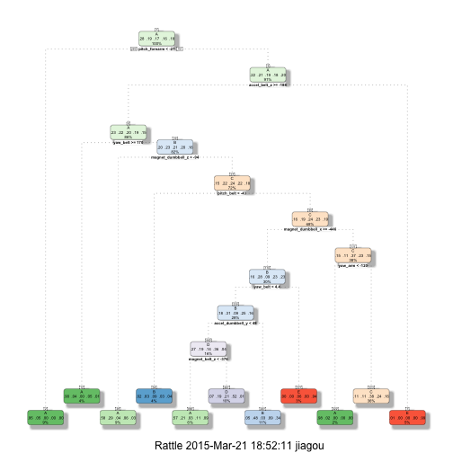

## Practical machine learning Course Project
### Background

Nowadays it is possible to collect a large amount of data about personal activity with numerous devices. In this project, the goal is to use data from accelerometers on the belt, forearm, arm, and dumbell of 6 participants to quantify how well people did in the exercises. There are five different manners in which they did the exercise: A,B,C,D and E. It is stored as the "classe" variable in the dataset. 

### Load data and other preparations
First we load the training and testing data to workspace. 

```r
train_data<-read.csv("pml-training.csv",na.strings=c("NA","#DIV/0!",""),sep=",")
test_data<-read.csv("pml-testing.csv",na.strings=c("NA","#DIV/0!",""),sep=",")
```

Some libraries are loaded for later analysis. 

```r
library(caret)
library(AppliedPredictiveModeling)
library(rpart.plot)
library(rattle)
```

### Exploratory analysis
To get a glimpse of the training data, we use *str* command to display the internal structure of it.

```r
str(train_data,list.len=15)
```

```
## 'data.frame':	19622 obs. of  160 variables:
##  $ X                       : int  1 2 3 4 5 6 7 8 9 10 ...
##  $ user_name               : Factor w/ 6 levels "adelmo","carlitos",..: 2 2 2 2 2 2 2 2 2 2 ...
##  $ raw_timestamp_part_1    : int  1323084231 1323084231 1323084231 1323084232 1323084232 1323084232 1323084232 1323084232 1323084232 1323084232 ...
##  $ raw_timestamp_part_2    : int  788290 808298 820366 120339 196328 304277 368296 440390 484323 484434 ...
##  $ cvtd_timestamp          : Factor w/ 20 levels "02/12/2011 13:32",..: 9 9 9 9 9 9 9 9 9 9 ...
##  $ new_window              : Factor w/ 2 levels "no","yes": 1 1 1 1 1 1 1 1 1 1 ...
##  $ num_window              : int  11 11 11 12 12 12 12 12 12 12 ...
##  $ roll_belt               : num  1.41 1.41 1.42 1.48 1.48 1.45 1.42 1.42 1.43 1.45 ...
##  $ pitch_belt              : num  8.07 8.07 8.07 8.05 8.07 8.06 8.09 8.13 8.16 8.17 ...
##  $ yaw_belt                : num  -94.4 -94.4 -94.4 -94.4 -94.4 -94.4 -94.4 -94.4 -94.4 -94.4 ...
##  $ total_accel_belt        : int  3 3 3 3 3 3 3 3 3 3 ...
##  $ kurtosis_roll_belt      : num  NA NA NA NA NA NA NA NA NA NA ...
##  $ kurtosis_picth_belt     : num  NA NA NA NA NA NA NA NA NA NA ...
##  $ kurtosis_yaw_belt       : logi  NA NA NA NA NA NA ...
##  $ skewness_roll_belt      : num  NA NA NA NA NA NA NA NA NA NA ...
##   [list output truncated]
```
So there are 19622 observations and 160 variables in the training data. Notice the last colomun *classe* is what we want to predict. We convert it to factors and calculate the number of cases fall into each manner type. As shown in the summary, the number of cases in each level is almost around the same magnitude.

```r
train_data$classe<-as.factor(train_data$classe)
summary(train_data$classe)
```

```
##    A    B    C    D    E 
## 5580 3797 3422 3216 3607
```
After careful investigation of the dataset I noticed there are many variables(or columns) have more than 14400 NA values out of 19622 observations. So I decide to throw those variables away and tighten the data set.

```r
NAcol <- apply(train_data,2,function(x) {sum(is.na(x))})
train_data <- train_data[,!(NAcol>14400)]
dim(train_data)
```

```
## [1] 19622    60
```
Also we can abandon variables with low variance. Now we have 59 variables left.

```r
nzvariable<-nearZeroVar(train_data,saveMetrics=TRUE)
head(nzvariable,6)
```

```
##                      freqRatio percentUnique zeroVar   nzv
## X                     1.000000  100.00000000   FALSE FALSE
## user_name             1.100679    0.03057792   FALSE FALSE
## raw_timestamp_part_1  1.000000    4.26562022   FALSE FALSE
## raw_timestamp_part_2  1.000000   85.53154622   FALSE FALSE
## cvtd_timestamp        1.000668    0.10192641   FALSE FALSE
## new_window           47.330049    0.01019264   FALSE  TRUE
```

```r
train_data<-train_data[,nzvariable$nzv==FALSE]
dim(train_data)
```

```
## [1] 19622    59
```

### Data partition
We devide the training set to two parts, 75% of the data goes into training set and 25% goes to the testing set. So we have 14718 observations for training and 4904 observations for testing.

```r
set.seed(123)
trainIndex <- createDataPartition(train_data$classe,p=3/4, list=FALSE)
training <- train_data[trainIndex,]
testing <- train_data[-trainIndex,]
dim(training)
```

```
## [1] 14718    59
```

```r
dim(testing)
```

```
## [1] 4904   59
```

For the prediction purpose, we don't need varibles such as ID, user_name, etc...So we remove those variables from the training set and store column names in *colns* for later usage.

```r
training<-training[,-c(1:7)]
colns <-colnames(training)
```

### Model 1: Decision tree
First we use decision tree model to train our data as it is easy to interpret. We change the default resampling method to cross validation in the hope of improving the accuracy.

```r
model1 <- train(classe~.,method="rpart",data=training,trControl=trainControl(method='cv'))
print(model1$finalModel)
```

```
## n= 14718 
## 
## node), split, n, loss, yval, (yprob)
##       * denotes terminal node
## 
##   1) root 14718 10533 A (0.28 0.19 0.17 0.16 0.18)  
##     2) pitch_forearm< -26.65 1325    60 A (0.95 0.045 0 0 0) *
##     3) pitch_forearm>=-26.65 13393 10473 A (0.22 0.21 0.19 0.18 0.2)  
##       6) accel_belt_z>=-187.5 12615  9701 A (0.23 0.22 0.2 0.19 0.15)  
##        12) yaw_belt>=169.5 593    58 A (0.9 0.037 0 0.054 0.0067) *
##        13) yaw_belt< 169.5 12022  9257 B (0.2 0.23 0.21 0.2 0.16)  
##          26) magnet_dumbbell_z< -93.5 1386   576 A (0.58 0.29 0.044 0.056 0.029) *
##          27) magnet_dumbbell_z>=-93.5 10636  8130 C (0.15 0.22 0.24 0.22 0.18)  
##            54) pitch_belt< -42.95 616   107 B (0.019 0.83 0.091 0.028 0.036) *
##            55) pitch_belt>=-42.95 10020  7570 C (0.16 0.19 0.24 0.23 0.19)  
##             110) magnet_dumbbell_x>=-446.5 4447  3186 B (0.16 0.28 0.091 0.23 0.23)  
##               220) yaw_belt< 4.415 4053  2792 B (0.18 0.31 0.094 0.25 0.16)  
##                 440) accel_dumbbell_y< 48.5 2393  1534 D (0.27 0.19 0.14 0.36 0.038)  
##                   880) magnet_belt_z< -376.5 946   411 A (0.57 0.21 0.034 0.11 0.087) *
##                   881) magnet_belt_z>=-376.5 1447   689 D (0.073 0.19 0.21 0.52 0.0062) *
##                 441) accel_dumbbell_y>=48.5 1660   865 B (0.055 0.48 0.028 0.093 0.34) *
##               221) yaw_belt>=4.415 394    23 E (0 0 0.058 0 0.94) *
##             111) magnet_dumbbell_x< -446.5 5573  3529 C (0.15 0.11 0.37 0.23 0.15)  
##               222) yaw_arm< -120 253     4 A (0.98 0.016 0 0 0) *
##               223) yaw_arm>=-120 5320  3276 C (0.11 0.11 0.38 0.24 0.16) *
##       7) accel_belt_z< -187.5 778     7 E (0.0077 0.0013 0 0 0.99) *
```
To get better visualization of the model, we print it with the function *fancyRpartPlot* in *rattle* package.

```r
fancyRpartPlot(model1$finalModel)
```

 

From the graph of the tree we see several varibles are used to build up the tree: yaw_belt, pitch_forarm, pitch_belt, etc. Apply this model to the training set to see the in sample error.

```r
pred1_0<-predict(model1,training)
conf1_0<-confusionMatrix(pred1_0,training$classe)
conf1_0
```

```
## Confusion Matrix and Statistics
## 
##           Reference
## Prediction    A    B    C    D    E
##          A 3394  680   93  210  126
##          B  103 1304  103  172  594
##          C  576  593 2044 1272  835
##          D  106  270  304  758    9
##          E    6    1   23    0 1142
## 
## Overall Statistics
##                                           
##                Accuracy : 0.5872          
##                  95% CI : (0.5792, 0.5951)
##     No Information Rate : 0.2843          
##     P-Value [Acc > NIR] : < 2.2e-16       
##                                           
##                   Kappa : 0.477           
##  Mcnemar's Test P-Value : < 2.2e-16       
## 
## Statistics by Class:
## 
##                      Class: A Class: B Class: C Class: D Class: E
## Sensitivity            0.8110   0.4579   0.7963  0.31426  0.42203
## Specificity            0.8947   0.9181   0.7304  0.94401  0.99750
## Pos Pred Value         0.7537   0.5729   0.3842  0.52384  0.97440
## Neg Pred Value         0.9226   0.8759   0.9443  0.87537  0.88454
## Prevalence             0.2843   0.1935   0.1744  0.16388  0.18386
## Detection Rate         0.2306   0.0886   0.1389  0.05150  0.07759
## Detection Prevalence   0.3060   0.1546   0.3615  0.09831  0.07963
## Balanced Accuracy      0.8529   0.6880   0.7633  0.62914  0.70976
```

Now we can apply the model to the testing set.

```r
pred1<-predict(model1,testing)
conf1<-confusionMatrix(pred1,testing$classe)
conf1
```

```
## Confusion Matrix and Statistics
## 
##           Reference
## Prediction    A    B    C    D    E
##          A 1140  240   42   70   54
##          B   28  432   36   59  165
##          C  197  200  674  425  295
##          D   30   76   95  250    4
##          E    0    1    8    0  383
## 
## Overall Statistics
##                                           
##                Accuracy : 0.5871          
##                  95% CI : (0.5731, 0.6009)
##     No Information Rate : 0.2845          
##     P-Value [Acc > NIR] : < 2.2e-16       
##                                           
##                   Kappa : 0.4762          
##  Mcnemar's Test P-Value : < 2.2e-16       
## 
## Statistics by Class:
## 
##                      Class: A Class: B Class: C Class: D Class: E
## Sensitivity            0.8172  0.45522   0.7883  0.31095  0.42508
## Specificity            0.8843  0.92718   0.7241  0.95000  0.99775
## Pos Pred Value         0.7374  0.60000   0.3763  0.54945  0.97704
## Neg Pred Value         0.9241  0.87643   0.9419  0.87548  0.88520
## Prevalence             0.2845  0.19352   0.1743  0.16395  0.18373
## Detection Rate         0.2325  0.08809   0.1374  0.05098  0.07810
## Detection Prevalence   0.3153  0.14682   0.3652  0.09278  0.07993
## Balanced Accuracy      0.8508  0.69120   0.7562  0.63047  0.71142
```

This model has a very low accuracy rate and the in sample error is just slightly smaller than the out of sample error. From the confusion matrix we see the accuracy of the model is about 0.5871 and the out of sample error is 1-0.5871=0.4129. 

### Model 2: Random forest
Next we use random forest model as it is known for high accuracy. Still the cross validation is used as resampling method and we choose to allow *allowparallel=TURE* to make it faster.

```r
model2 <- train(classe~.,method="rf",data=training,trControl=trainControl(method='cv',number=6,allowParallel=TRUE))
model2
```

```
## Random Forest 
## 
## 14718 samples
##    51 predictor
##     5 classes: 'A', 'B', 'C', 'D', 'E' 
## 
## No pre-processing
## Resampling: Cross-Validated (6 fold) 
## 
## Summary of sample sizes: 12265, 12265, 12264, 12266, 12265, 12265, ... 
## 
## Resampling results across tuning parameters:
## 
##   mtry  Accuracy   Kappa      Accuracy SD   Kappa SD    
##    2    0.9921864  0.9901152  0.0005427956  0.0006867814
##   26    0.9912354  0.9889116  0.0036528387  0.0046237950
##   51    0.9865474  0.9829814  0.0040594681  0.0051403466
## 
## Accuracy was used to select the optimal model using  the largest value.
## The final value used for the model was mtry = 2.
```
The model behaves quite good in the training set with possible risk of overfitting.

```r
pred2_0<-predict(model2,training)
conf2_0<-confusionMatrix(pred2_0,training$classe)
conf2_0
```

```
## Confusion Matrix and Statistics
## 
##           Reference
## Prediction    A    B    C    D    E
##          A 4185    0    0    0    0
##          B    0 2848    0    0    0
##          C    0    0 2567    0    0
##          D    0    0    0 2412    0
##          E    0    0    0    0 2706
## 
## Overall Statistics
##                                      
##                Accuracy : 1          
##                  95% CI : (0.9997, 1)
##     No Information Rate : 0.2843     
##     P-Value [Acc > NIR] : < 2.2e-16  
##                                      
##                   Kappa : 1          
##  Mcnemar's Test P-Value : NA         
## 
## Statistics by Class:
## 
##                      Class: A Class: B Class: C Class: D Class: E
## Sensitivity            1.0000   1.0000   1.0000   1.0000   1.0000
## Specificity            1.0000   1.0000   1.0000   1.0000   1.0000
## Pos Pred Value         1.0000   1.0000   1.0000   1.0000   1.0000
## Neg Pred Value         1.0000   1.0000   1.0000   1.0000   1.0000
## Prevalence             0.2843   0.1935   0.1744   0.1639   0.1839
## Detection Rate         0.2843   0.1935   0.1744   0.1639   0.1839
## Detection Prevalence   0.2843   0.1935   0.1744   0.1639   0.1839
## Balanced Accuracy      1.0000   1.0000   1.0000   1.0000   1.0000
```

Next we apply the trained model to predict the observations in the testing set.

```r
#getTree(model2$finalModel,k=3)
pred2<-predict(model2,testing)
conf2<-confusionMatrix(pred2,testing$classe)
conf2
```

```
## Confusion Matrix and Statistics
## 
##           Reference
## Prediction    A    B    C    D    E
##          A 1393    2    0    0    0
##          B    1  945    7    0    0
##          C    0    2  847   21    0
##          D    1    0    1  781    1
##          E    0    0    0    2  900
## 
## Overall Statistics
##                                           
##                Accuracy : 0.9923          
##                  95% CI : (0.9894, 0.9945)
##     No Information Rate : 0.2845          
##     P-Value [Acc > NIR] : < 2.2e-16       
##                                           
##                   Kappa : 0.9902          
##  Mcnemar's Test P-Value : NA              
## 
## Statistics by Class:
## 
##                      Class: A Class: B Class: C Class: D Class: E
## Sensitivity            0.9986   0.9958   0.9906   0.9714   0.9989
## Specificity            0.9994   0.9980   0.9943   0.9993   0.9995
## Pos Pred Value         0.9986   0.9916   0.9736   0.9962   0.9978
## Neg Pred Value         0.9994   0.9990   0.9980   0.9944   0.9998
## Prevalence             0.2845   0.1935   0.1743   0.1639   0.1837
## Detection Rate         0.2841   0.1927   0.1727   0.1593   0.1835
## Detection Prevalence   0.2845   0.1943   0.1774   0.1599   0.1839
## Balanced Accuracy      0.9990   0.9969   0.9925   0.9853   0.9992
```
We can see the accuracy is about 0.9923 so the out of sample error is 1-0.9923=0.0077 for predictions made against the cross-validation set. 


### Test model on testing set
For the testing data, we need to classify 20 test cases. First we extract the variables(columns) needed for prediction. And then the random forest model is used because of the high accuracy. The results is shown in answers.

```r
test_data <- test_data[colns[colns!='classe']]
answers <- predict(model2, newdata=test_data)
answers
```

```
##  [1] B A B A A E D B A A B C B A E E A B B B
## Levels: A B C D E
```

